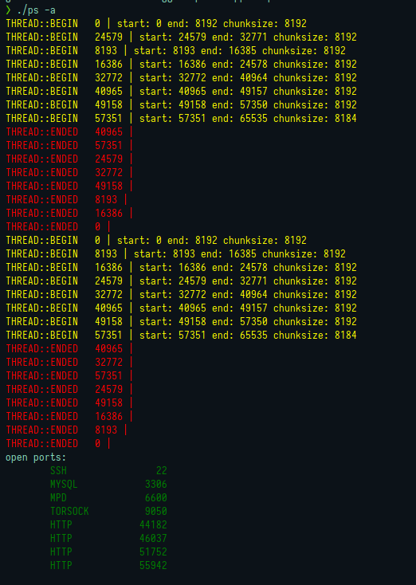

# Port Scanner



- Simple port scanner in c++23
- Multithreading ( jthread )
- uses sockets to connect to ports to see if they are open
- sends data to port and listens for data to try and determine the service on the port

# Build

### Dependencies

- libfmt
- g++14

```sh
make
```

# TEST

- To see the ports and threads running

```sh
make test
```
